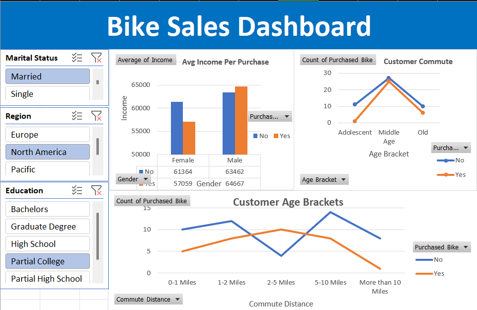

# 🚴 Bike Sales Dashboard (Excel)  

An interactive Excel dashboard analyzing bike purchase behavior across different demographics, income levels, education, and commute distances.  

---

## 🔎 Purpose  

The dashboard helps understand factors influencing bike sales and customer behavior, enabling targeted marketing and sales strategies.  

---

## 🛠 Tech Stack  

- **Microsoft Excel** → Data analysis, pivot tables, and visualization  
- **Slicers & Pivot Charts** → Interactive filtering and drill-downs  
- **Formulas & Aggregations** → Used for KPIs and summary statistics  
- **Dataset** → Bike sales dataset (customer demographics & purchase info)  

---

## 📂 Data Source  

- **Source**: Bike Sales dataset (Excel)  
- **Dataset includes**:  
  - Customer demographics (age, gender, education, marital status, region)  
  - Income and commute distance  
  - Purchase decision (Yes/No)  

---

## 🌟 Features & Highlights  

### Business Problem  
Understanding what influences bike purchases helps businesses design targeted campaigns and optimize sales.  

### Goal of the Dashboard  
To provide a simple, interactive Excel dashboard that identifies trends in bike sales by customer demographics and lifestyle factors.  

### Walkthrough of Key Visuals  
- **Avg Income Per Purchase** → Shows income distribution of buyers vs. non-buyers by gender.  
- **Customer Commute vs. Bike Purchase** → Highlights relationship between commute distance and purchase decisions.  
- **Customer Age Brackets** → Compares bike purchases across different age categories.  
- **Interactive Filters** → Slice by marital status, region, or education level for focused analysis.  

### Business Impact & Insights  
- **Targeted Marketing** → Identify demographics most likely to purchase bikes.  
- **Sales Optimization** → Focus strategies on regions and income groups with higher buying potential.  
- **Behavioral Insights** → Commute distance and education level significantly influence bike purchases.  

---

## 📸 Dashboard Preview  

  

---

## 🚀 How to Use  

1. Open the `.xlsx` file in **Microsoft Excel**.  
2. Use the slicers (marital status, region, education) to filter results.  
3. Analyze customer demographics, income, and commute impact on bike sales.  
4. Use insights to design targeted campaigns and improve decision-making.  
